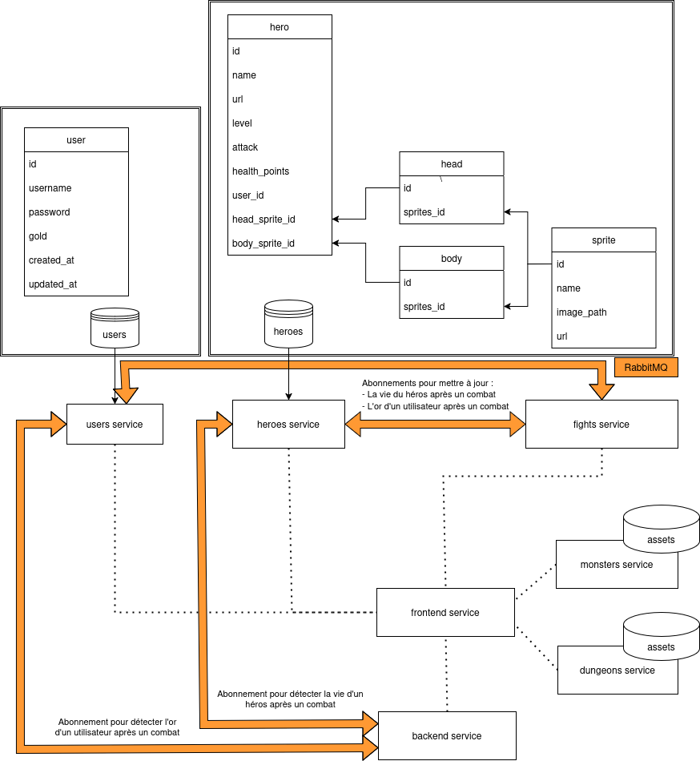

# DungeonGame : Architecture Micro-Services

## Présentation

Ce projet a pour but de créer un jeu sur navigateur en utilisant une architecture basée sur des micro-services.

Le concept principal du jeu est simple : 

- L’utilisateur peut créer des héros et visualiser une liste complète des héros disponibles.
- Après avoir choisi ou créé un héros, celui-ci peut être envoyé dans un donjon.
- Le but du jeu est de terminer le donjon en atteignant sa destination finale.

|  |  |  |
|------------------|------------------|------------------|
|  |  |  |
|------------------|------------------|------------------|
|  |  |  |

> **Plus d'informations**
>
> Il est possible d'accéder au cahier des charges en se rendant au [lien](https://docs.google.com/document/d/1Eci92m6q-oKlKMv--bAx6Pk5aolsxWc57Y1MMQFHlyA/edit?tab=t.0) suivant

---

## Définition du besoin

### Fonctionnalités principales

1. **Gestion des héros**
   - Création de héros avec des caractéristiques spécifiques (PV, niveau, attaque)
   - Liste des héros disponibles visible lors de la connexion

2. **Donjons**
   - Donjons générés ou prédéfinis au moment où le héros entre dedans
   - Donjons linéaires ou avec embranchements
   - Chaque case du donjon peut contenir un combat

3. **Système de combat**
   - Un combat se termine lorsque les PV d'un des participants atteignent 0

### Contraintes Techniques

1. **Architecture Micro-Services**
   - Le projet doit être réalisé avec une approche micro-service
   - Une première étape consiste à fournir un schéma représentant l’architecture des micro-services

2. **Technologies Utilisées**
   - **Backend :** Spring Boot (recommandé pour sa simplicité)
   - **Base de données :** Minimum une technologie de base de données
   - **File d’attente :** Minimum une technologie de file d’attente

3. **Frontend**
   - Peut être textuel ou visuel (aucune obligation de créer un jeu 2D ou 3D)
   - Doit être exécutable localement pour interagir avec les services

4. **Livraison**
   - Le code doit être déposé dans un repository public sur GitHub
   - Un fichier `docker-compose` est attendu pour faciliter le déploiement

### Cas d'utilisation

- Je veux créer mon compte utilisateur
- Je veux me connecter à mon compte utilisateur
- Je veux récupérer la liste des héros existants
- Je veux créer un héros personnalisé et non modifiable
- Je veux créer un nouvel héros
- Je veux choisir mon héros
- Je veux rentrer dans un donjon
- Je veux me déplacer dans le donjon selon des touches génériques
- Je veux tuer des monstres et gagner de l'or
- Je veux aller au donjon suivant
- Je veux sortir du donjon

---

## Architecture du logiciel

Voici un graphe représentant notre architecture micro-services :

### Services

Pour la réalisation de ce projet, les services suivants vont être mis en place :
- Service `frontend`
  - *Description* : Utilisé pour le frontend de l'application
  - *Technologies* : `React`
- Service `backend`
   - *Description* : Utilisé pour instancier **RabbitMQ** entre le frontend et les différents services
   - *Technologies* : `NodeJS`, `websocket`, `RabbitMQ`
- Service `dungeons`
   - *Description* : Utilisé pour la gestion des donjons
   - *Technologies* : `NodeJS`
   - [Description API](./dungeons-service/README.md)
- Service `fights`
   - *Description* : Utilisé pour la gestion des combats
   - *Technologies* : `SpringBoot`, `RabbitMQ`
   - [Description API](./fights-service/README.md)
- Service `heroes`
   - *Description* : Utilisé pour la gestion des héros
   - *Technologies* : `SpringBoot`, `RabbitMQ`
   - [Description API](./heroes-service/README.md)
- Service `monsters`
   - *Description* : Utilisé pour la gestion des monstres
   - *Technologies* : `SpringBoot`
   - [Description API](./monsters-service/README.md)
- Service `users`
   - *Description* : Utilisé pour la gestion des utilisateurs
   - *Technologies* : `SpringBoot`, `RabbitMQ`
   - [Description API](./users-service/README.md)

### Base de données

Pour réaliser ce projet, deux bases de données sont nécessaires :
- Base de données `users`
   - *Description* : Utilisé par le service `users`
   - *Type de base de données* : `PostgreSQL`
- Base de données `heroes`
   - *Description* : Utilisé par le service `heroes`
   - *Type de base de données* : `PostgreSQL`

>  **Modèles utilisés**
> 
> Les modèles utilisés au sein de la base de données sont définis dans le graphe d'architecture.

### Queues

Au sein de ce projet, 4 queues ont été mises en place avec **RabbitMQ** :
- Queue `queue-fights-to-users-gold`
  - *Sender* : Service `fights`
  - *Receiver* : Service `users`
  - *Description* : Permet de mettre à jour l'or d'un utilisateur à la suite d'un combat
- Queue `queue-fights-to-heroes-health`
   - *Sender* : Service `fights`
   - *Receiver* : Service `heroes`
   - *Description* : Permet de mettre à jour la santé d'un héros à la suite d'un combat
- Queue `queue-heroes-to-frontend-health`
   - *Sender* : Service `heroes`
   - *Receiver* : Service `backend`
   - *Description* : Permet de récupérer la santé du héros mise à jour à la suite d'un combat
   - **Attention** : Le message est reçu par le service `backend` et reçu par le service `frontend` via des websockets
- Queue `queue-users-to-frontend-gold`
   - *Sender* : Service `users`
   - *Receiver* : Service `backend`
   - *Description* : Permet de mettre à jour l'or d'un utilisateur mis à jour à la suite d'un combat
  - **Attention** : Le message est reçu par le service `backend` et reçu par le service `frontend` via des websockets

---

## Installation du projet

Pour installer ce projet, suivre ces étapes :
- Copier le fichier `env.example`
- Le coller à la racine du projet et le renommer en `.env`
- Compléter les variables d'environnement
  - `DB_USERS_POSTGRES_DB` : La base de données utilisée pour les utilisateurs
  - `DB_USERS_POSTGRES_USER` : L'utilisateur de la base de données des utilisateurs
  - `DB_USERS_POSTGRES_PASSWORD` : Le mot de passe de l'utilisateur
  - `DB_USERS_PORT` : Le port à ouvrir sur le poste local pour la base de données des utilisateurs
  - `DB_HEROES_POSTGRES_DB` : La base de données utilisée pour les héros
  - `DB_HEROES_POSTGRES_USER` : L'utilisateur de la base de données des héros
  - `DB_HEROES_POSTGRES_PASSWORD` : Le mot de passe de l'utilisateur
  - `DB_HEROES_PORT` : Le port à ouvrir sur le poste local pour la base de données des héros
  - `SERVICE_FRONTEND_PORT` : Le port à ouvrir sur le poste local pour le service `frontend`
  - `SERVICE_BACKEND_PORT` : Le port à ouvrir sur le poste local pour le service `backend`
  - `SERVICE_USERS_SECURITY_JWT_EXPIRATION_TIME` : La durée de vie d'un token JWT
  - `SERVICE_USERS_SECURITY_JWT_SECRET_KEY` : La clé secrète utilisée pour générer un JWT
    - Pour générer le secret, vous pouvez utiliser la commande `openssl rand -base64 32`
  - `SERVICE_USERS_PORT` : Le port à ouvrir sur le poste local pour le service `users`
  - `SERVICE_FIGHTS_PORT` : Le port à ouvrir sur le poste local pour le service `fights`
  - `SERVICE_HEROES_PORT` : Le port à ouvrir sur le poste local pour le service `heroes`
  - `SERVICE_DUNGEONS_PORT` : Le port à ouvrir sur le poste local pour le service `dungeons`
  - `SERVICE_MONSTERS_PORT` : Le port à ouvrir sur le poste local pour le service `monsters`
  - `SPRING_RABBITMQ_SEND_PORT` : Le port à ouvrir sur le poste local pour l'envoi `RabbitMQ`
  - `SPRING_RABBITMQ_VIEW_PORT` : Le port à ouvrir sur le poste local pour la consultation `RabbitMQ`
  - `SPRING_RABBITMQ_USERNAME` : L'utilisateur `RabbitMQ`
  - `SPRING_RABBITMQ_PASSWORD` : Le mot de passe de l'utilisateur `RabbitMQ`
- Démarrer l'ensemble des conteneurs avec la commande `docker compose up -d --build`
